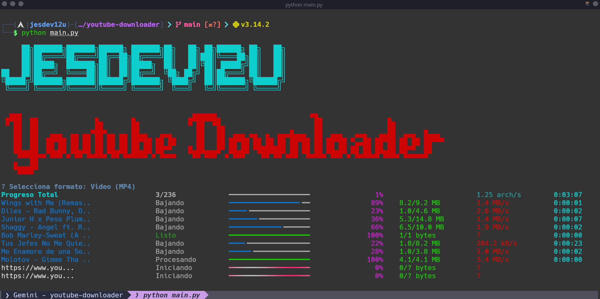

# YouTube Downloader 🚀



Una herramienta de CLI potente y estética para descargar música (MP3) y videos (MP4) de YouTube de forma masiva y simultánea.

## ✨ Características

- ⚡ **Descargas Simultáneas:** Procesa hasta 10 links al mismo tiempo.
- 🎨 **Interfaz Moderna:** UI limpia con barras de progreso estilo Docker y colores optimizados.
- 🛠️ **Menú Interactivo:** Selección fácil entre formato de Audio o Video.
- 📋 **Gestión de Links:** Solo coloca tus URLs en un archivo y la herramienta se encarga del resto.
- 🛡️ **Manejo de Errores:** Registro automático de fallos en `errors.log` sin interrumpir la experiencia.

## 🚀 Requisitos

- Python 3.8+
- [FFmpeg](https://ffmpeg.org/) instalado en el sistema (necesario para la conversión a MP3).
- Las dependencias se encuentran en el entorno virtual.

## 🛠️ Instalación y Uso

1. **Clonar el repositorio:**
   ```bash
   git clone https://github.com/tu-usuario/youtube-downloader.git
   cd youtube-downloader
   ```

2. **Configurar el entorno virtual e instalar dependencias:**
   ```bash
   python -m venv .venv
   source .venv/bin/activate  # En Linux/macOS
   pip install yt-dlp rich questionary
   ```

3. **Agregar links:**
   Edita el archivo `links` y añade una URL de YouTube por línea.

4. **Ejecutar:**
   ```bash
   python main.py
   ```

## 📝 Notas
- El programa limpia automáticamente las tareas finalizadas para mantener la pantalla despejada.
- Los archivos descargados se guardan en la carpeta `out/`.
- Desarrollado por **JesDev12U**.